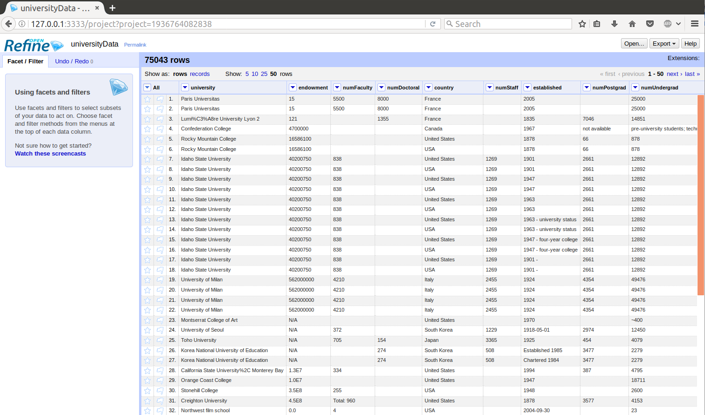

# What is OpenRefine?

OpenRefine is a [free](https://www.gnu.org/philosophy/free-sw.en.html), [open source](https://github.com/OpenRefine/OpenRefine), Java application, that runs offline in a web browser.

**You can use OpenRefine to:**
 * Get an overview of a data set
 * Split complex data fields into more granular parts
 * Clean up tabular data by removing inconsistencies in format and terminology
 * Enhance a data set with data from other sources

# Data Security

OpenRefine operates using your web browser as a web client/server app, but OpenRefine server runs on your personal machine and nothing is sent out over the Internet. All of the data cleaning and transformation operations can be done without any external network services. Some operations, like connecting to Google Drive files or using reconciliation services, will connect OpenRefine to the Internet.

OpenRefine project data is stored in the 'workspace directory'. A default workspace directory is setup on your local computer when you first run OpenRefine, or you can set it yourself through a setting. More information can be found on the [Where is Data Stored? FAQ](https://github.com/OpenRefine/OpenRefine/wiki/FAQ%3A-Where-Is-Data-Stored%3F).

Additionally, OpenRefine works on a "copy" of your data. Your original data is not affected by any of the actions performed in OpenRefine. OpenRefine requires that your export your updated data.

# Data Types

Refine can handle all sorts of data, but works best with structured tabular data.

- Import formats: TSV, CSV, custom separator txt, Excel, XML, JSON, Google Spreadsheets, RDF
- Sources: local file, archive (zip), URL, clipboard, or Google

It is important to understand some terminology when reffering to data in OpenRefine.

OpenRefine can be used with data sets with 100,000s of rows, but remember some actions may be slow in very large datasets. More memory can be allotted to OpenRefine if you anticipate that you will be working with large data sets. More information can be found on the [Allocate More Memory FAQ](https://github.com/OpenRefine/OpenRefine/wiki/FAQ:-Allocate-More-Memory).

# Use Cases

**Clean** - discover and fix inconsistency with faceting, clustering, cell transforms, GREL expressions...

**Transform** - change formats or reshape with split/join multi valued cells, split columns, transpose columns/rows...

**Extend** - enrich data by combining files, merging projects, fetching URLs, reconciliation with online databases...

**Automate** - reuse your processing routine by exporting operation history in JSON!
