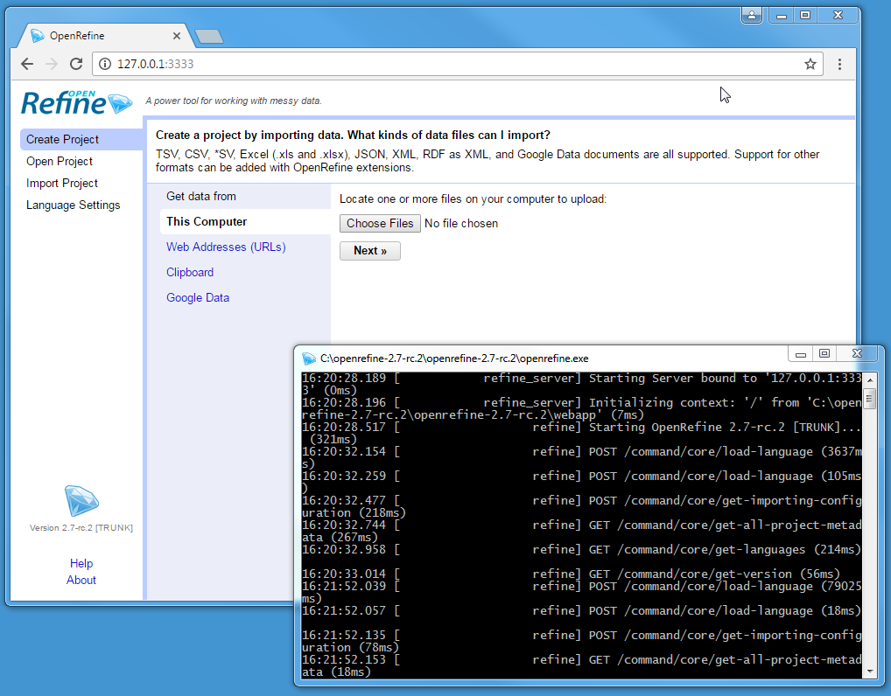

# Setup OpenRefine

1. **Install Java:** OpenRefine is a [Java](http://java.com/en/) application and requires Java JRE to run. Download and install Java if you do not have it. Clicking "Free Java Download" on the [Java](http://java.com/) site will get you the correct version. (When installing be sure to uncheck the "recommended" option to add Yahoo to your browsers!)
2. **Download Refine:** Download the most recent [OpenRefine package](http://openrefine.org/download.html) for your OS. Releases are posted on the [OpenRefine site](http://openrefine.org/download.html) or [GitHub releases page](https://github.com/OpenRefine/OpenRefine/releases/). (this workshop used openrefine-3.1)
3. **Extract Refine:** Unzip the OpenRefine package to a permanent location, for example in your User directory or Documents.
    - Windows: unzip by right clicking and selecting Extract All.
    - Mac: drag the `dmg` to the application folder.
    - Linux: unpack in desired location with with `tar`, for example `tar xzf openrefine-linux-2.8.tar.gz`.

Full documentation is available on the [official wiki](https://github.com/OpenRefine/OpenRefine/wiki/), including more detailed [installation instructions](https://github.com/OpenRefine/OpenRefine/wiki/Installation-Instructions).

# Start OpenRefine

1. **Start the Java app:** Opening Refine differs depending on your OS, but in most cases the app will start running in a terminal window which you can ignore and minimize (but do not close!).
    - Windows: double click `openrefine.exe` (You may get a warning that the publisher could not be verified, ignore it, and click *Run*. Once open, pin the Refine icon to your taskbar for easy access in the future).
    - Mac: click Refine icon.
    - Linux: in the OpenRefine directory open terminal and type `./refine`.
2. **Use the GUI:** Once Refine is running in a terminal, your default web browser should automatically open with the interface. If it does not open automatically or you close the browser tab, find the GUI by typing <http://127.0.0.1:3333> or `localhost:3333` in your address bar. The user interface is rendered by your web browser, but Refine is not a web application. No information is sent online and no internet connection is necessary.
3. **Shut down:** close any browser tabs with the GUI, then stop the host terminal window with `Ctrl+C`. This will ensure any open projects are saved.

# Troubleshooting Installation

Depending on security settings on your computer, OpenRefine may be blocked from opening. If you are having trouble getting OpenRefine to run, try checking out the OpenRefine [Installation Instructions](https://github.com/OpenRefine/OpenRefine/wiki/Installation-Instructions), where common issues and solutions are listed.
